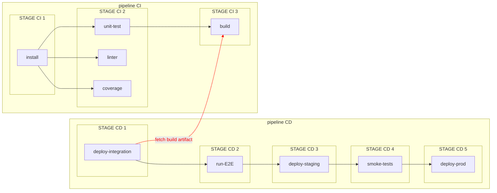

[](https://goreportcard.com/report/github.com/guiyomh/gitlab-wizard)

# Gitlab-wizard

This project is a command line, to provide help in automating pipelines with Gitlab.

## Features

- Download artifacts from a specific job and a specific commit

## Instalation

### Requirements

- Golang >=1.14

### Install

```bash
go get github.com/guiyomh/gitlab-wizard
go install github.com/guiyomh/gitlab-wizard
```

## Usage

### Artifact Download

This command downloads an artifact from a successful job for a given commit ID.

For example if you have specialized pipelines:

- a CI pipeline on each commit
- a CD pipeline on tag



You can recover the artifact produced by job as follows:

```bash
gitlab-wizard artifact download \
    -token <your-token>  \
    -job load_translation \
    -project=16 \
    -commit 93cd32a8e3704551e6ab8905f4af7942939805cf \
    --extract
```
